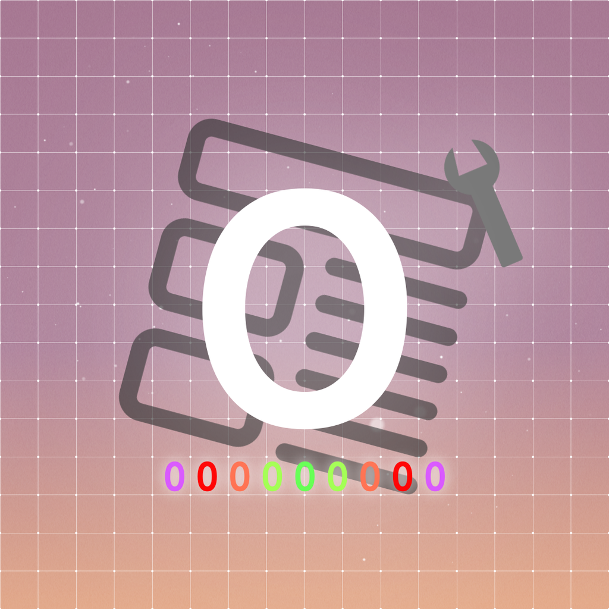

# Overlayer
Overlayer is a mod that displays texts in ADOFAI in-game.   
Originally made by [c3nb](https://github.com/c3nb).
### [Overlayer Guide](https://overlayer.mod-g.cc/)

# Licenses
[RapidGUI](https://github.com/fuqunaga/RapidGUI) is licensed under the MIT License.   
[UnityCodeEditor](https://github.com/joshcamas/UnityCodeEditor/) is Unlicensed but it uses MIT Licensed Code.